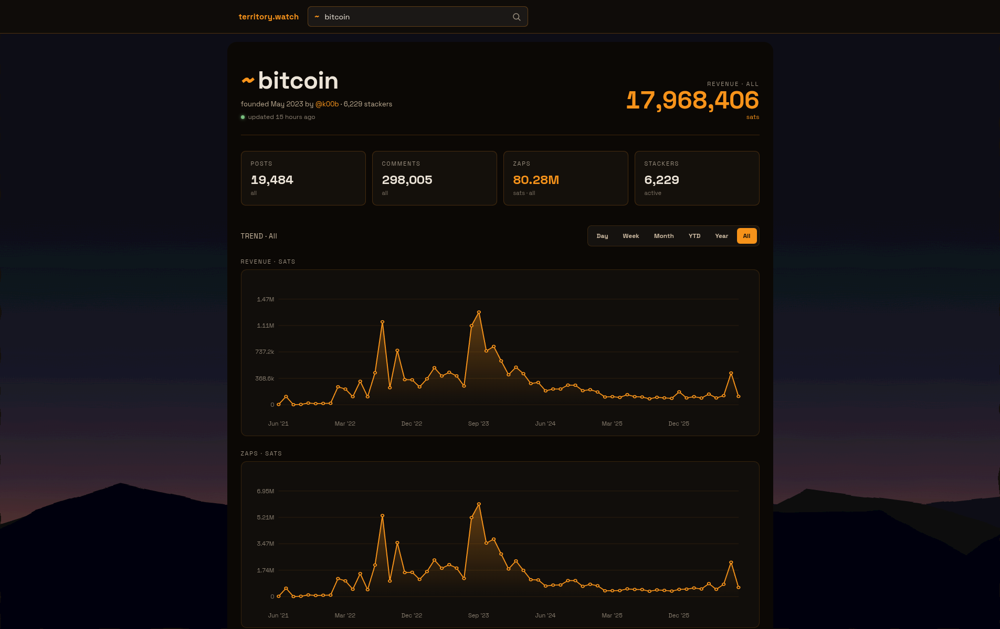

# territory.watch



[territory.watch](https://territory.watch) exists to support territory founders.

For now, it's just a static website to look up the revenue and other stats of a
territory.

**The data isn't incrementally updated yet, because it's not trivial: there's no
zap feed, so we would need to refetch every item to see if it was zapped since
the last time we checked.**

_It also exists because I wanted to experiment with Claude Design, and I got
delusions of grandeur: Maybe this could become a staging ground for new features
built into Stacker News, or a safe environment for stackers who want to learn
how to code in a zero-mutual-expectations FOSS setting (with or without AI),
with an (experienced) reviewer (me). It's a static site with minimal JS;
fuck-ups would be impressive._

## Layout

```
Makefile              how we build stuff here
main.go               thin entry point; dispatches to the cmd package
cmd/                  command-line interface
  cmd.go                subcommand dispatcher + usage
  fetch_cmd.go          tw fetch: fetch a territory's feed in NDJSON
  aggregate_cmd.go      tw aggregate: reduce the feed to dashboard JSON
  aggregate.go          sats/posts/comments bucketing per time range
  ndjson.go             streamable feed format
static/               static
  index.html            whole UI (100% generated by Claude Design)
  data/<name>-agg.json  per-territory data produced by tw aggregate
  territories.txt       list of all territories (used by Makefile)
data.tar.gz           static/ as a gzip archive
```

## Generate a territory's data

```
$ make build <territory>
```

This will create two files:

* static/data/\<territory\>-feed.ndjson: Territory feed as fetched from the SN API
* static/data/\<territory\>-agg.json:    Aggregated data for the HTML view

See Makefile for more details.

## View the site

This will serve static/ with Caddy on localhost:8080:

```
$ nix run
```

## Deployment

This is still a bit manual for now. In production, I am using nginx on NixOS
with this (partial) config:

```nix
"territory.watch" = {
    listen = [
        { addr = ipv4; port = 80; }
        { addr = ipv4; port = 443; ssl = true; }
    ];
    forceSSL = true;
    useACMEHost = "territory.watch";

    # Serve files from a mutable path so we can update data without a
    # system rebuild.
    root = "/var/www/territory.watch";

    # Try existing file first (e.g. /data/<territory>-agg.json), else
    # return index.html for smooth SPA transitions.
    locations."/".tryFiles = "$uri /index.html =404";
};
```

To update the site, only the files in /var/www/territory.watch need to be
updated:

```
$ ssh territory.watch
$ git pull
$ tar xvzf data.tar.gz static/
$ rsync -r --delete \
    --chown=nginx:nginx --chmod=D755,F644 \
    ./static/ /var/www/territory.watch/
```

